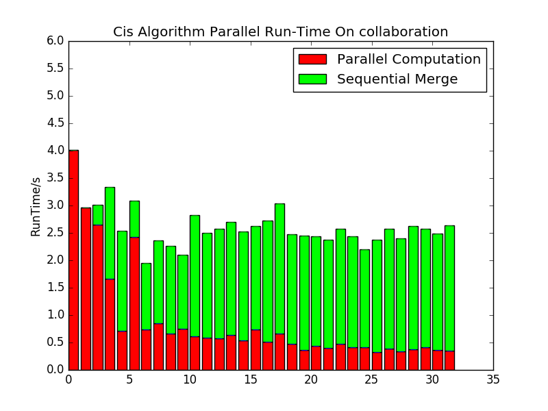
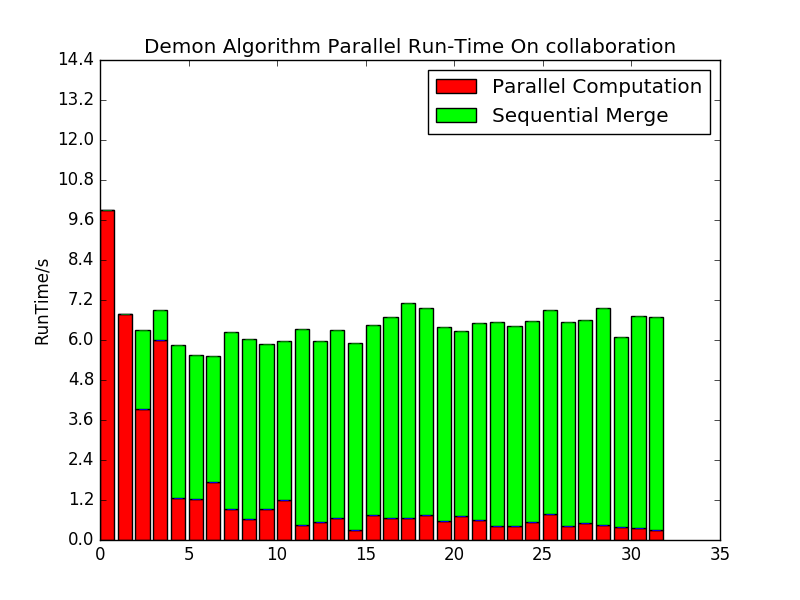
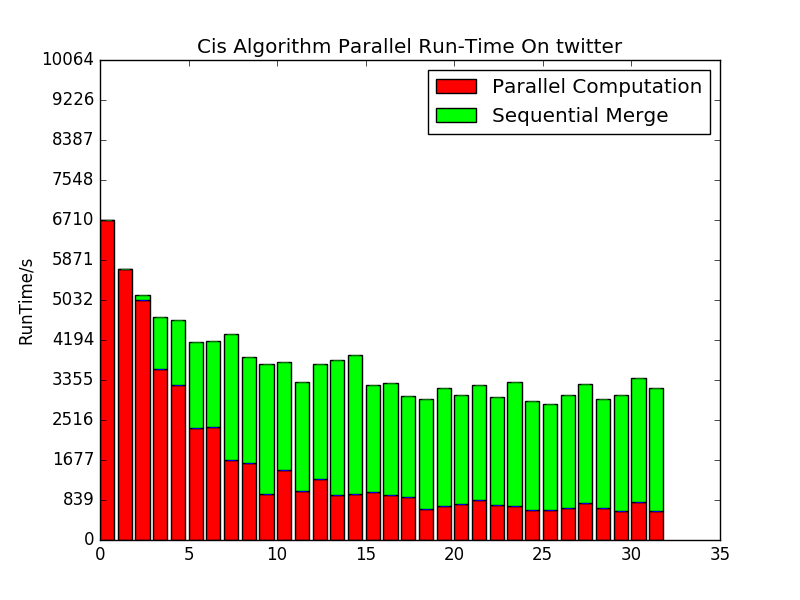
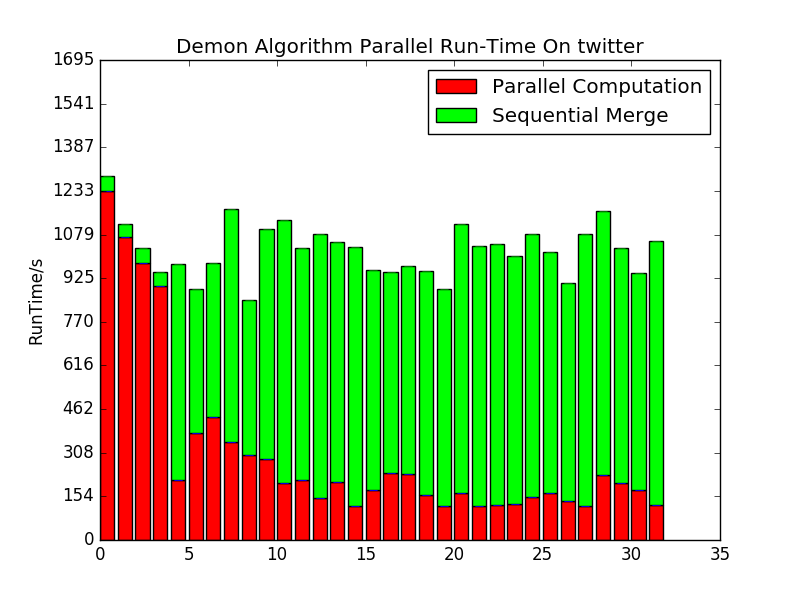

#Current Work
- Reimplement Algorithm [*Connected Iterative Scan*](./test_cis.cpp)
- Reimplement Algorithm [*Demon*](./test_daemon.cpp)
- Implement [Parallelizer](./parallelizer.h) for local-based overlapping community detection algorithms
- [Util](./util) *Draw Figures*  (e.g as facebook output handling)
```zsh
python get_statistics.py ../demo_output_files/  facebook
```

#Pending Work
- Reimplement Algorithm *GCE*

#Build Environment
- Build with Cmake 3.3, Gcc 5.3, std = C++ 14
- Dependencies : Boost, Pthreads
- To use [Util](./util) to draw the figures, need Python 2.7 and [ANACONDA](https://www.continuum.io/downloads) installed

#Build & Run & Exp
1. In current directory, do as follows to compile the program, getting the result of executables, i.e, CISTest and Daemon_Test.
```zsh
cmake .
make
```

2. Then source the [shell script](./run_cis_demon.sh) and run the function in that script as follows, the first argument is the test input file path,
 the second argument is the output file directory and your prefix for the output file name.
```zsh
source run_cis_demon.sh
run_with_different_thread_count demo_input_files/collaboration_edges_input.csv demo_output_files/your_prefix_
```

3. Draw the experiment figures with [Util](./util), the procedures are as follows. The first argument is the path of output directory,
 the second argument is your prefix for the output file name.
```zsh
cd util/
python get_statistics.py ../demo_output_files/  your_prefix
```

#Environment(CPU Checking)
- Physical    

  ```zsh
  cat /proc/cpuinfo |grep "physical id"|sort |uniq|wc -l  
  ```
- Logical    

  ```zsh
  cat /proc/cpuinfo |grep "processor"|wc -l
  ```
- Core   

  ```zsh
  cat /proc/cpuinfo |grep "cores"|uniq
  ```

#Experiment
- Merge operation just sequentially execute  
- Overlap some merge with Local computation, not significant  

##Collaboration 20 thousand edges
Laptop(2-core) | Desktop(4-core)
-------------- | ---------------
 | 
  | 

##Facebook 80 thousand edges
Laptop(2-core) | Desktop(4-core)
-------------- | ---------------
  | 
  | 

##Twitter 1.7 million edges  
   


#Attention Please/Advice For Pthread Programming
- Pthread_Create, void * have to make the input arguments existing until they are joined
- Pay attention to dead lock

#Potential Improvement Points(Old)
- For CIS algorithm, the merge operation takes a lot of time for the dataset of collaboration, which is sequential,sequential 4s, parallel 2.4s
- For Demon algorithm, not exist such problem, and the execution time is very long, 13s for parallel and 24s for sequential,
the merge operation do not take a lot of time