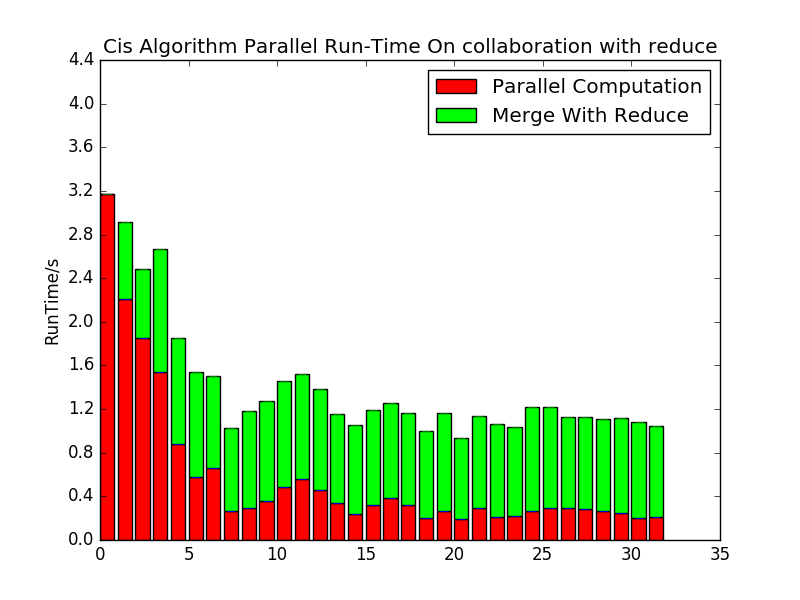
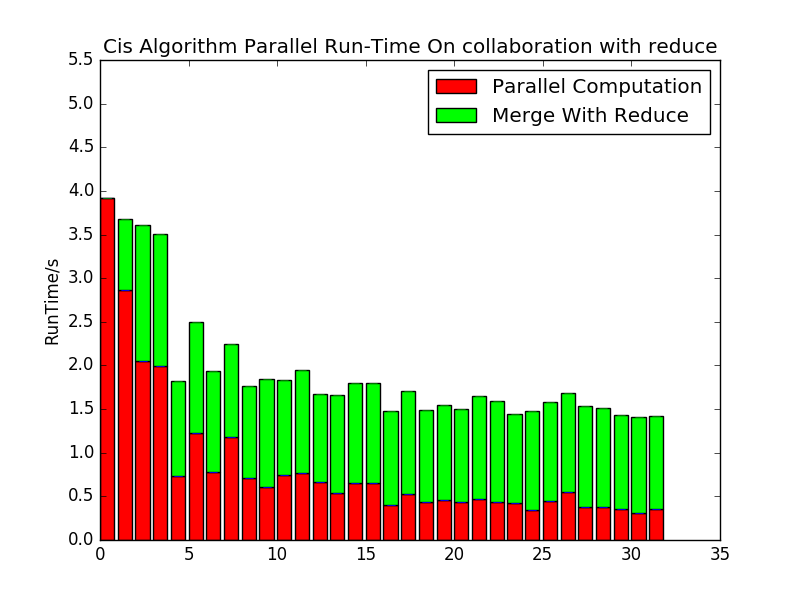
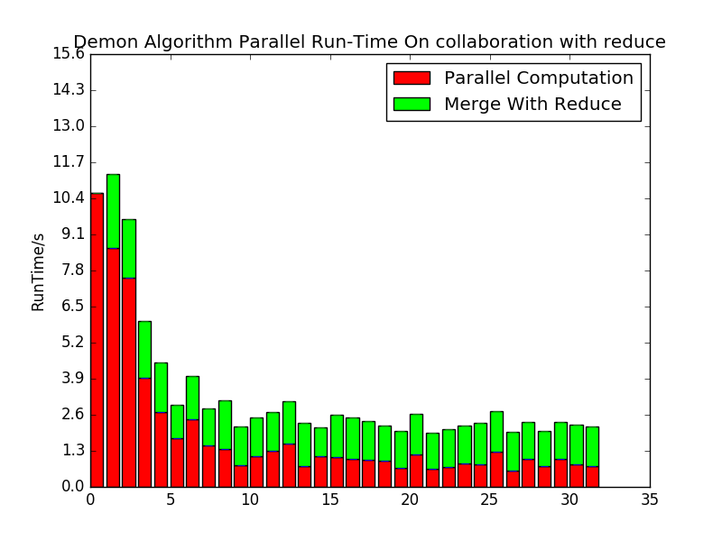
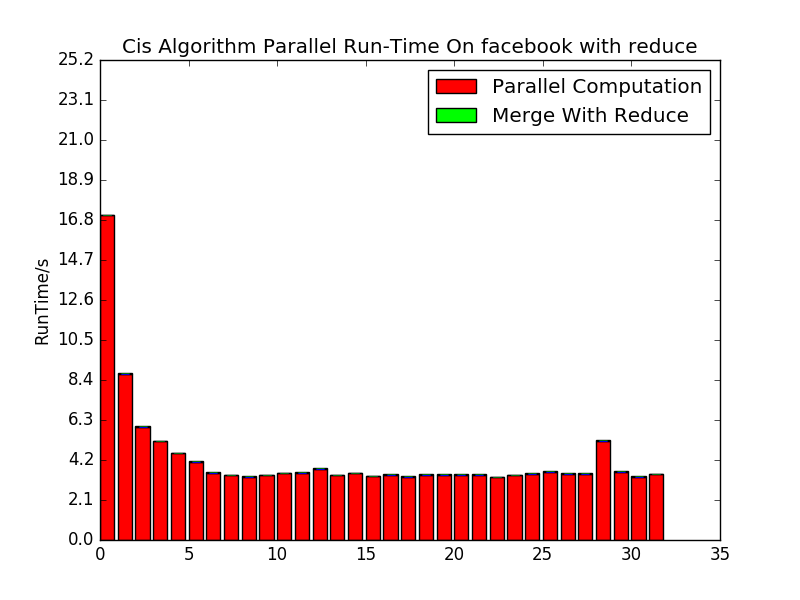
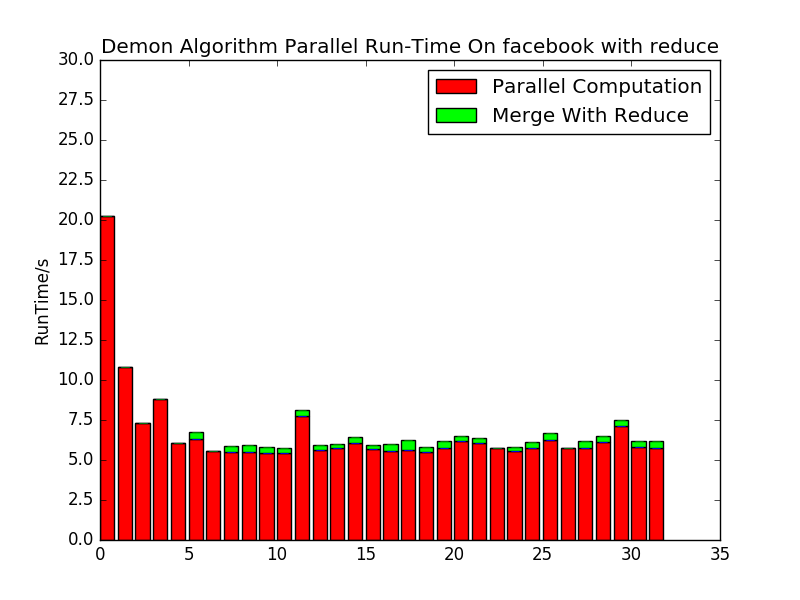
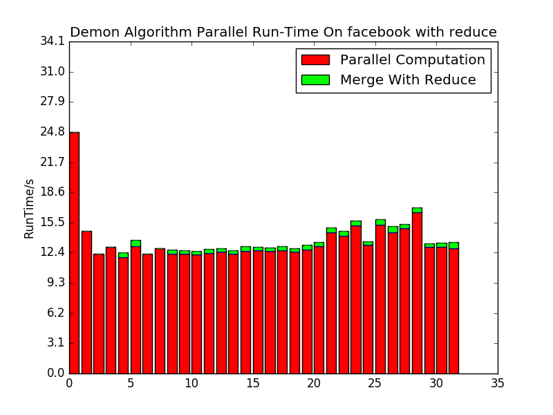

#Current Work
- Reimplement Algorithm [*Connected Iterative Scan*](./test_cis.cpp)
- Reimplement Algorithm [*Demon*](./test_daemon.cpp)
- Implement [Parallelizer](./parallelizer.h) for local-based overlapping community detection algorithms
- Implement [Reducer](./reducer.h) for reducing data in parallel
- [Util](./util) *Draw Figures*  (e.g as facebook output handling) (add suffix with_reduce_ for current version)
```zsh
python get_statistics.py ../demo_output_files/  facebook
python get_statistics.py ../demo_output_files/  facebook_with_reduce_
```
#Pending Work
- Reimplement Algorithm *GCE*
- Performance Evaluation Indices  

#Build Environment
- Build with Cmake 3.3, Gcc 5.3, std = C++ 14
- Dependencies : Boost, Pthreads
- To use [Util](./util) to draw the figures, need Python 2.7 and [ANACONDA](https://www.continuum.io/downloads) installed

#Build & Run & Exp
- In current directory, do as follows to compile the program, getting the result of executables, i.e, CISTest and Daemon_Test.  
```zsh
cmake . -DBoost_NO_BOOST_CMAKE=ON
make
```   
Add The Flag to make it correctly built on the GPU-Cluster.

- Then source the [shell script](./run_cis_demon.sh) and run the function in that script as follows, the first argument is the test input file path,
 the second argument is the output file directory and your prefix for the output file name.  
```zsh
source run_cis_demon.sh
run_with_different_thread_count demo_input_files/collaboration_edges_input.csv demo_output_files/your_prefix_  seq
run_with_different_thread_count demo_input_files/collaboration_edges_input.csv demo_output_files/your_prefix_with_reduce_  reduce
```
- Draw the experiment figures with [Util](./util), the procedures are as follows. The first argument is the path of output directory,
 the second argument is your prefix for the output file name.  
```zsh
cd util/
python get_statistics.py ../demo_output_files/  your_prefix
python get_statistics.py ../demo_output_files/  your_prefix_with_reduce
```

#Environment(CPU Checking)
- Physical    

  ```zsh
  cat /proc/cpuinfo |grep "physical id"|sort |uniq|wc -l  
  ```
- Logical    

  ```zsh
  cat /proc/cpuinfo |grep "processor"|wc -l
  ```
- Core   

  ```zsh
  cat /proc/cpuinfo |grep "cores"|uniq
  ```

#Experiment
- Merge operation just sequentially execute  
- Overlap some merge with Local computation, not significant  

##Collaboration 20 thousand edges
Laptop(2-core) | Desktop(4-core)
-------------- | ---------------
 | 
  | 

##Facebook 80 thousand edges
Laptop(2-core) | Desktop(4-core)
-------------- | ---------------
  | 
  | 

##Twitter 1.7 million edges  
   


#Improvement With Reduce
- Add reduce computation for merge, but have some extra overhead from the figures.
- Need to confirm the effectiveness of the final result(pending..)

##Collaboration 20 thousand edges
Desktop(4-core)-NoReduce | Desktop(4-core)-Reduce
------------------------ | ----------------------
 | 
 | 

Laptop(2-core)-NoReduce | Laptop(2-core)-Reduce
------------------------ | ----------------------
 | 
 | 

##Facebook 80 thousand edges
Desktop(4-core)-NoReduce | Desktop(4-core)-Reduce
------------------------ | ----------------------
 | 
 | 

Laptop(2-core)-NoReduce | Laptop(2-core)-Reduce
------------------------ | ----------------------
 | 
 | 

#Attention Please/Advice For Pthread Programming
- Pthread_Create, void * have to make the input arguments existing until they are joined
- Pay attention to dead lock

#Potential Improvement Points(Old)
- For CIS algorithm, the merge operation takes a lot of time for the dataset of collaboration, which is sequential,sequential 4s, parallel 2.4s
- For Demon algorithm, not exist such problem, and the execution time is very long, 13s for parallel and 24s for sequential,
the merge operation do not take a lot of time
